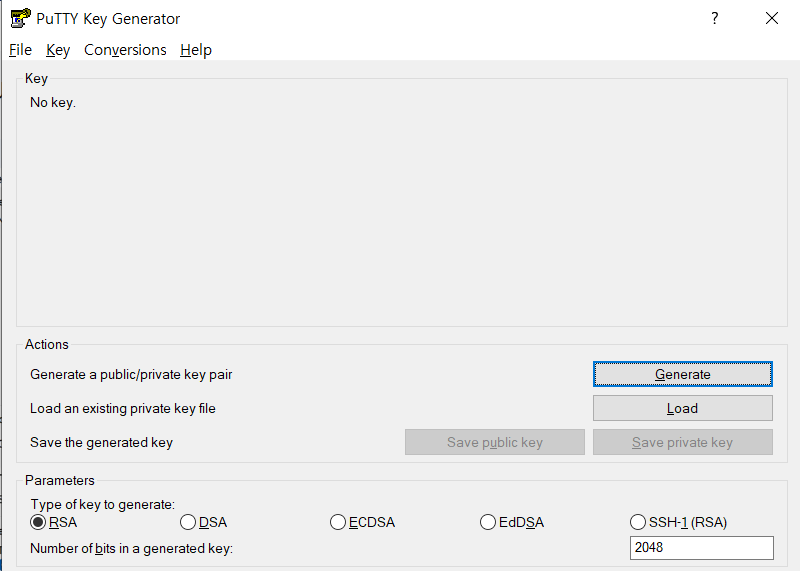
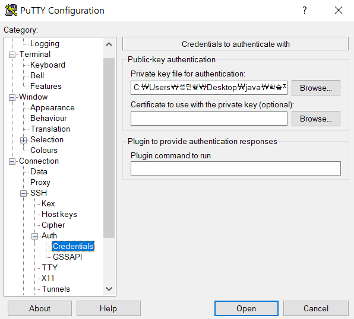

# AWS EC2 시작하기

**※저는 Ubuntu 를 사용하여 진행하였습니다.※**

&nbsp;    
&nbsp;


## Aws Ec2 인스턴스 생성 
>[인스턴스 생성 참고 블로그](https://velog.io/@jonghyun3668/SpringBoot-%ED%94%84%EB%A1%9C%EC%A0%9D%ED%8A%B8-EC2-%EB%B0%B0%ED%8F%AC%ED%95%98%EA%B8%B0#1-aws-%EC%84%B8%ED%8C%85%ED%95%98%EA%B8%B0)

&nbsp;    
&nbsp;    


   
##  EC2 원격 접속

>  EC2 원격 접속 하는 방법은 제가 해본 방법은 2가지 입니다.   
> 1. `CMD` 또는 `GitBash` 명령어로 접속 (GodBash)
> 2. `PuTTY` 사용

&nbsp;    
&nbsp;     

## GitBash 로 연결하기
>  **1. 먼저  SSHKey 발급 받은 디렉토리에서 GitBash 키기**  
>   (아무 디렉토리에서 해당 키 있는 디렉토리로 이동해도 상관없음)

&nbsp;  


> **2. pem 파일 권한을 바꿔준다**      
>  &nbsp;&nbsp;&rarr; pem 파일 자체에 너무 많은 권한이 허용 되어 있기에 그대로 사용하면   
>   &nbsp;&nbsp;&nbsp;&nbsp;&nbsp;&nbsp;&nbsp;&nbsp;permission 에러가 나기 때문이라고 합니다.
>   ```bash
> // 권한 바꾸기   
> // 4 는 읽기, 2는 쓰기, 1은 실행
> // 7은 읽기, 쓰기, 실행이 전부 있는것
> // 권한 3자리는 순서대로 /User/그룹/전체/ 를 의미한다고 합니다.
> // 400 은 그럼 무엇일까요
> // User만 읽기 권한이 있고 나머지는 전혀 없는 것 입니다.
> 
> chmod 400 sshkey명.pem 
>   ```

&nbsp;

> **3.EC2 인스턴스에 접속**
> ```bash
>   ssh -i "sshkey명.pem" ubuntu@자신의EC2퍼블릭주소
>        ex)ssh -i "sshKey.pem" ubuntu@ ec2-XX-XX-XXX-XXX.ap-northeast-2.compute.amazonaws.com
> ```


&nbsp;     
&nbsp;     

## PuTTY 로 연결하기
> **1. 먼저 인스턴스 생성 하면서 만든 sshKey.pem 파일로 PPK 생성을 한다.(PuTTYgen)**
>
>
> - load 클릭 후 .pem 파일 열기
> - Save private Key 클릭
> - .ppk 확장자로 저장

&nbsp;    

> **2. 연결하기**   
> 
> 
> - HostName 칸에 Ec2 인스턴스의 퍼블릭 IPv4 주소를 입력 
>   - ! Ubuntu 사용시 앞에 ubuntu@ 필수 !
> - 좌측 카테고리에서 /SSH/AUTH/Credentials 클릭
> &nbsp;    
> &nbsp;
> 
> 
> - Private Ket file for authentication 에 방금 생성한 ppk 파일 넣기
> - open 버튼 클릭
>  &nbsp;     
>  &nbsp;   
> 
> 
> 
> - 연결 성공