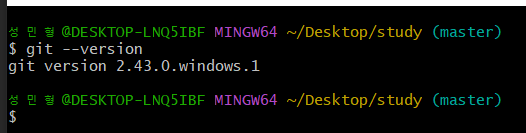

# 2강. Git 설치하기

&nbsp;    
&nbsp;

## 1. 깃 다운로드
> - https://git-scm.com/ 접속   
> &nbsp;   
> 
> - 다운로드 시작

&nbsp;

## 2. Setup
> - 설제 과정에서 Git Bash 를 포함하여 설치하기       
> &nbsp;   
> 

### GitBash 란?
> PowerShell 같은 터미널 프로그램, 리눅스 기반 CLI 프로그램이다.

### GitBash 사용이유
> 1. Git 사용에 적합한 터미널
> 2. 리눅스/유닉스 에서 사용되는 CLI 명령어들을 윈도우에서 사용 가능
>    -  타 프로그래밍에서도 유용

&nbsp;

## 3.설치 확인
> - GitBash 에서 git --version 명령어 사용 해보기   
> &nbsp;   
>  
> - 사진처럼 나오면 정상적으로 설치가 된 것!

※ GUI 프로그램은 소스트리 다운로드!