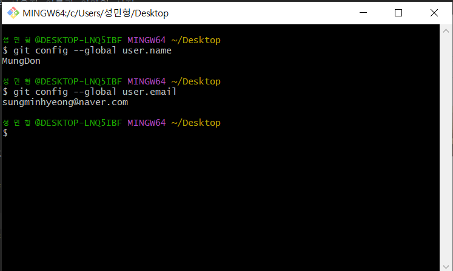
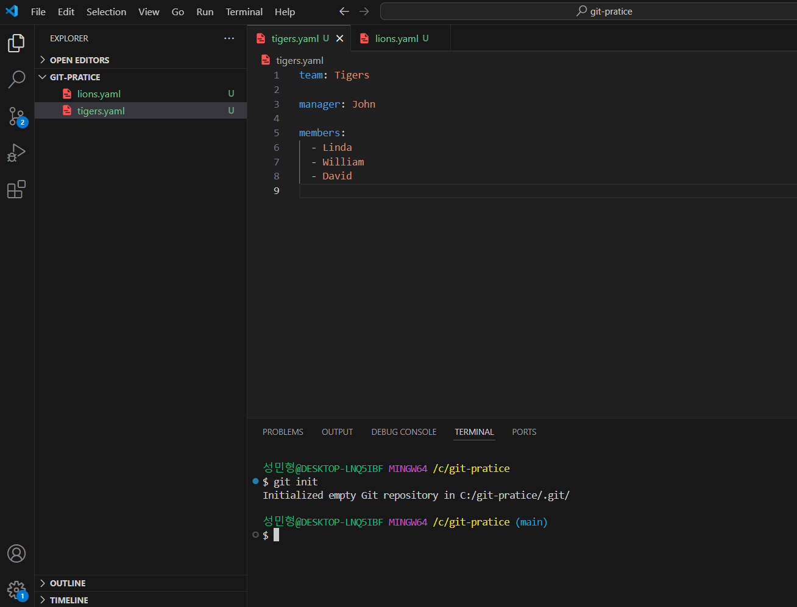
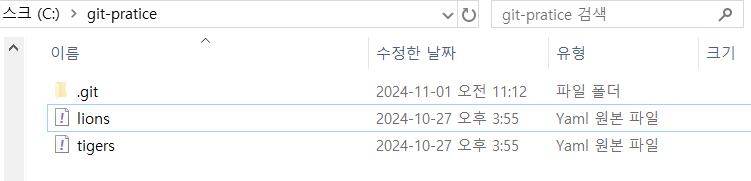
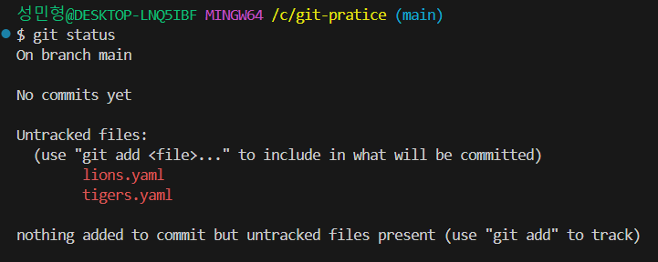

# 4강. Git 시작하기


## 1. Git 최초 설정
- Git 전역으로 사용자 이름과 이메일 설정
 ```bash 
git config --global user.name "(본인 이름)"
```
```bash
  git config --global user.email "(본인 이메일)"
```
&nbsp;    

- 등록된 사용자 이름, 이메일
```bash
    git config --global user.name
```
```bash
    git config --global user.email
```

&nbsp;    

- 기본 브랜치 명 변경 -- (master / slave 흑인 노예 논란)
```java
    git config --global init.defaultBranch main
```

&nbsp;    
&nbsp;    

## 2. 프로젝트 생성 & GIT 관리 시작
- **연습용 프로젝트 생성 후 VScode로 열기**
- VScode 터미널에서 git init 명령어 입력


**※.git : Git이 해당 프로젝트를 관리하는 내역이 이 폴더 안에 들어있음(삭제 시 증발)**

&nbsp;    
&nbsp;   

- 파일을 추가하고 git status 명령어 입력

- 해당 사진의 의미는 해당 파일들이 깃의 관리 후보로 올라와 있다는 뜻 (아직 git에서 관리 안함)