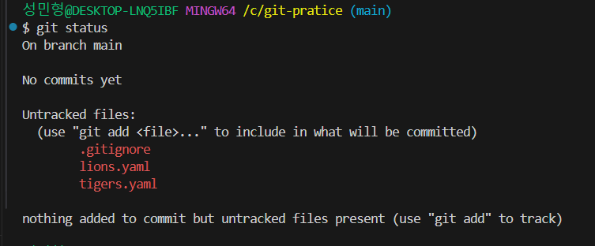

# 5강. .gitignore 파일은 뭘까?

&nbsp;    
&nbsp;


## .gitignore 이란
> - 단어 그대로 Git 의 관리에서 배제 한다는 뜻
> - .gitignore 파일 안에 배제하여야할 파일 명을 작성하면 Git에서 해당 파일 관리 배제

&nbsp;    
&nbsp;


## Git의 관리에서 특정 파일/폴더를 배제해야 할 경우
> - 포함해야 할 필요가 없을 때
>   - 자동으로 생성 또는 다운로드되는 파일들(빌드 결과물, 라이브러리)   
>   &nbsp;   
> - 포함하지 말아야 할 때
>   - 보안상 민감한 정보를 담은 파일(Properties,yml 등)

&nbsp;    
&nbsp;

## 실습
- 새로운 파일 secrets.yaml 생성 후 git status 명령어 실행    
    
  &nbsp;

- .gitignore 파일 생성 후 secrets.yaml 작성   
   
  &nbsp;

- 다시 git status 명령어 실행
     
  &nbsp;

#### 해당 사진과 같이 git에서 배제 되는것을 확일 할 수 있다.


&nbsp;    
&nbsp;

## .gitignore 형식
```text
# 이렇게 #를 사용해서 주석

# 모든 file.c
file.c

# 최상위 폴더의 file.c
/file.c

# 모든 .c 확장자 파일
*.c

# .c 확장자지만 무시하지 않을 파일
!not_ignore_this.c

# logs란 이름의 파일 또는 폴더와 그 내용들
logs

# logs란 이름의 폴더와 그 내용들
logs/

# logs 폴더 바로 안의 debug.log와 .c 파일들
logs/debug.log
logs/*.c

# logs 폴더 바로 안, 또는 그 안의 다른 폴더(들) 안의 debug.log
logs/**/debug.log
```