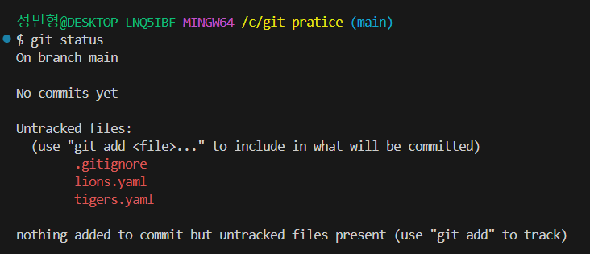
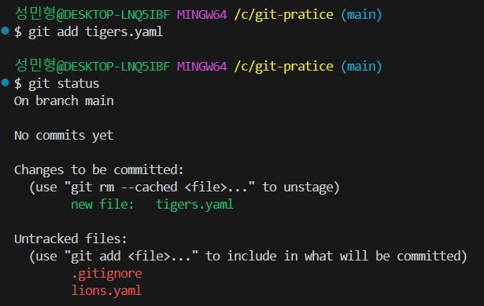
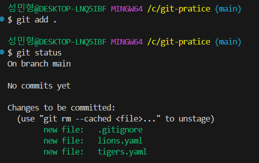
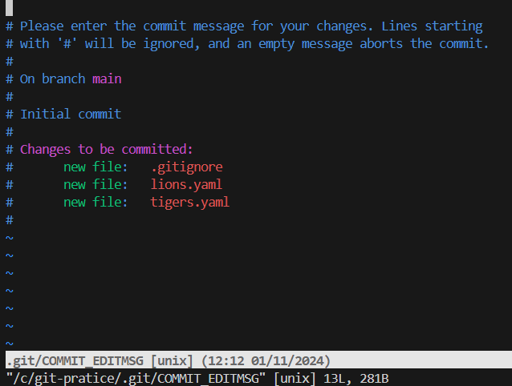
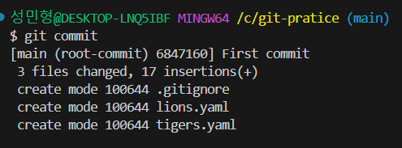
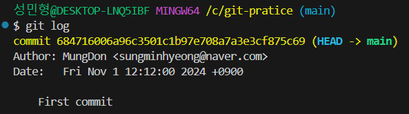

# 6강. 변화를 타임캡슐에 담아 묻기(버전 관리)

&nbsp;    
&nbsp;

## 프로젝트의 변경사항들을 타임캡슐(버전)에 담기
> 1. 변경 사항 확인

※ Untracked files : Git에 관리에 들어간적 없는 파일    

&nbsp;   

> 2. 파일 하나 담기 `git add tigers.yaml` 명령어 실행

    

&nbsp;     

>3. 모든 파일 담기 `git add .` 명령어 실행

&nbsp;    
&nbsp;

## 타임캡슐 묻기
> 1.`git commit` 명령어 실행

   
**[Vim 모드](https://github.com/MungDon/MyStudyRepository/blob/master/Git_Inflearn/%5B6-1%5DVim.md) 진입**    

&nbsp;

> 2. First Commit 메세지 입력한 다음 저장 및 종료

     

&nbsp;     

> 2-1. `git commit -m '메세지'` 이런식으로 한번에 가능

&nbsp;

> 3. `git log` 명령어로 commit 확인

