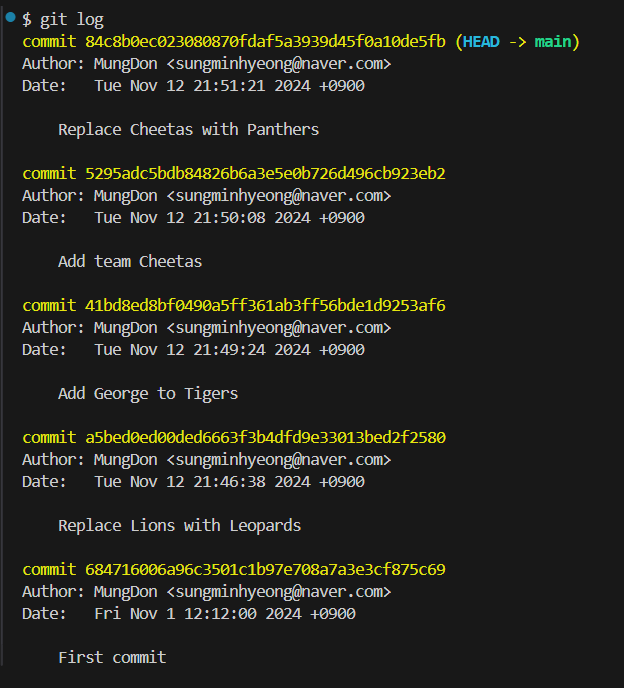
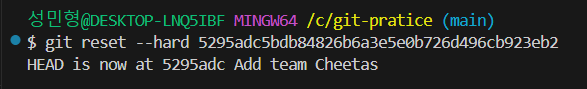
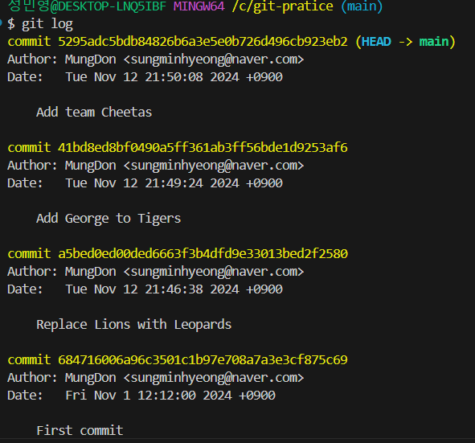
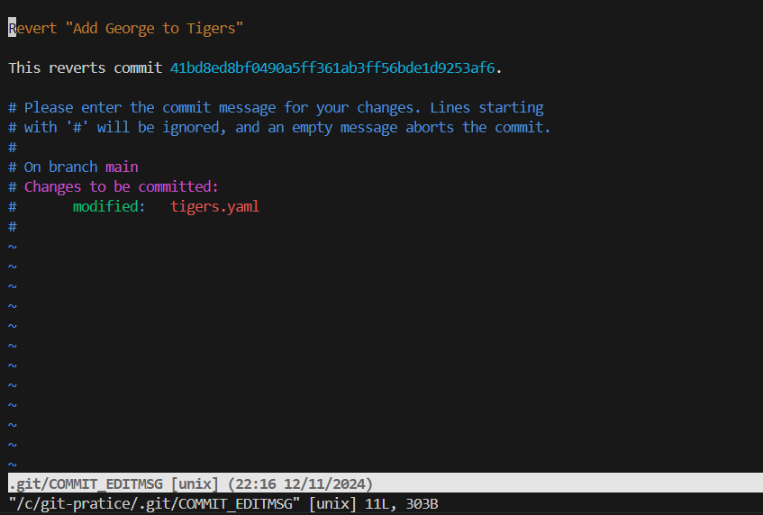
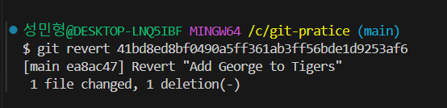
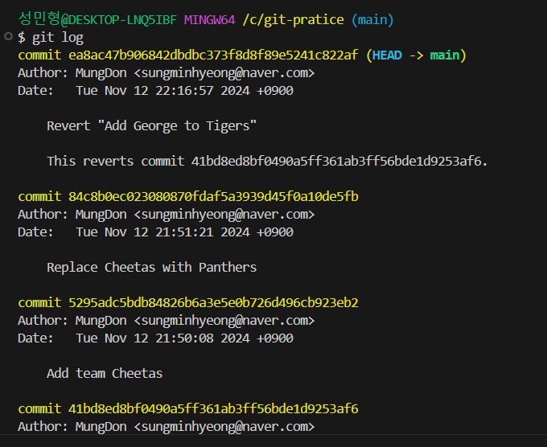

# 7강. 과거로 돌아가기

&nbsp;    
&nbsp;     

## Git에서 과거로 돌아가는 두가지 방법!
> 1. **revert**
>    - 되돌리기 원하는 시점의 커밋을 거꾸로 실행한다.  
> &nbsp;
> 2. **reset**
>    - 원하는 시점으로 돌아간 뒤 이후 내역을 삭제한다.

&nbsp;    
&nbsp;     

## 실습

**현재 커밋 로그**    

#### 1. Add team Cheetas  커밋 시점으로 돌아가기(reset 명령어 사용)
> git reset --hard (돌아갈 커밋의 해시)    
> **git reset --hard 만하고 해시코드를 붙이지 않으면 제일 최신의 커밋으로 돌아간다.**

&nbsp;

**명령어 실행 후 커밋 로그**     
   

> 이처럼 reset은 되돌아간 커밋 시점 이후의 커밋내역을 모두 삭제해 버린다 

&nbsp;    
&nbsp;   

#### 2. Replace Lions with Leopards 커밋 시점으로 돌아가기 (revert 명령어 사용)
> - git revert (돌아갈 커밋 해시)

     
> 해당 명령어 실행 시 자동으로 커밋 메세지가 작성되어있어 :wq 로 저장하고 나가기 하면 완료 된다.

     

&nbsp;    

**명령어 실행 후 커밋 로그**     
     

> 이처럼 revert는 되돌아간 시점의 내용을 거꾸로 수행하고 새로운 커밋 내역으로 만들어 기존 커밋 내역은 삭제 되지 않는다.    
> 따라서 Add George to Tigers 의 이전 커밋인 Replace Lions with Leopards 시점으로 돌아가게 되는 것 
> (협업에서 사용)