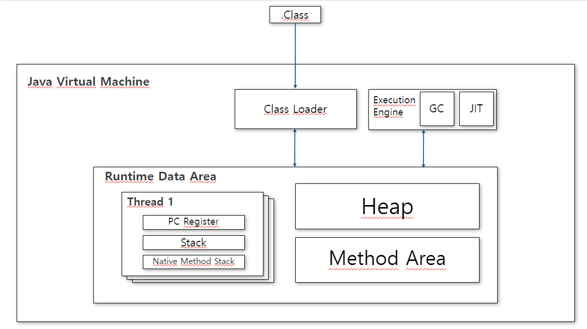

# JVM   

&nbsp;

## JVM (Java Virtual Machine) 이란?
> - 자바를 실행하기 위한 가상 머신
> - OS에 종속 받지 않고 CPU 가 JAVA를 인식, 실행할 수 있게 하는 가상 컴퓨터

&nbsp;
&nbsp;    

## JVM 의 구성

### 클래스 로더(Class Loader)   
>   - JVM 내로 클래스 파일 로드, 링크를 통해 배치하는 작업을 수행하는 모듈    
>   - 런 타임 시 동적으로 클래스 파일 로드, jar 파일 내 저장된 클래스들을 JVM 위에 탑재   
>   &nbsp;&nbsp;&nbsp;&nbsp;   
> 
>   ※ 즉, 클래스를 처음으로 참조할 때, 해당 클래스를 로드하고 링크하는 역할을 한다.   

&nbsp;

### 실행 엔진(Execution Engine)
- 클래스 로더가 JVM내의 런타임 데이터 영역에 바이트 코드를 배치 시키면, 실행 엔진에 의해 실행된다.
>   - 인터프리터(Interpreter)   
>     - 바이트 코드를 명령어 단위로 읽어서 실행하는 방식, 한 줄씩 수행하기에 느리다.

>  - JIT 컴파일러(Just-in-time)   
>    - 동적 번역이라고도 하며, 프로그램 실제 실행하는 시점에 기계어로 번역하는 컴파일 기법   
>    - 전체 실행이 느린 인터프리터 방식의 단점을 보완하기 위해 자주 실행되는 코드를 감지하여 컴파일 한다.  
>    - 자주 실행되는 코드가 아닌경우 인터프리터 방식이 더 유리하다.

>  - 가비지 컬렉터(Garbage collector)   
>    - 더 이상 사용되지 않는 인스턴스를 찾아 메모리 삭제

&nbsp;

### 런 타임 데이터 영역(Runtime Data Area)   
  - 자바 애플리케이션이 실행될 때 사용하는 데이터들이 저장되는 메모리 공간이다.   

####  1. Thread 공유 영역  
> - 메서드(클래스,스태틱) 영역(Method Area)   
>   -  가장 먼저 데이터가 저장 됨 
>   - 클래스 로더에 의해 로드 된 클래스, 메서드정보와 필드 변수, 전역 변수의 바이트코드 저장
>   - 프로그램 시작부터 종료 시 까지 메모리에 적재
>   - 명시적 Null 선언 시 가비지 컬렉터가 청소

> - 힙 영역(Heap Area)  
>   - 런타임 시 동적으로 할당하여 사용하는 영역
>   - 런타임 시 결정되는 참조형 데이터가 저장됨(new 연산자로 생성되는 클래스 및 인스턴스 변수, 배열 타입 등)
>   - 객체가 더이상 쓰이지 않거나 명시적 Null 선언시  GC 가 청소

#### 2. Thread 비공유 영역
>  - 스택(stack Area)
>      - 기본 자료형(원시 자료형), 지역 변수, 매개 변수가 저장되는 메모리 영역
>      - 스레드 하나당 스택 하나씩 생성되고, 각 스레드들이 독립적으로 가지고 있는 공간
>      - Heap 영역에 생성 된 객체의 참조값이 할당
>      - 메서드가 호출 될 때 메모리에 할당, 종료 시 삭제
>      - LIFO(Last In First Out) 특징을 가짐

>  - PC 레지스터(PC Register)
>    - 현재 수행중인 JVM 명령의 주소를 저장하는 영역
>    - 스레드가 생성될 때 마다 생기는 공간으로, 스레드가 어떠한 명령을 실행하게 될 지에 대한 기록   

>  
> - 네이티브 메서드 스택(Native Method Stack)
>   - 자바 외의 언어로 작성된 네이티브 코드를 실행하기 위한 스택   
>   - Java Native Interface 를 통해 바이트코드로 변환   

&nbsp;  
&nbsp;  

## 동작
> 1. 자바 소스 코드(.java) 를 컴파일러(javac)가 바이트코드로 변환(.class)
> 2. 컴파일러가 생성한 바이트코드를 실행 할 수 있도록 JVM 이 각 운영체제에 맞는 기계어로 변환

