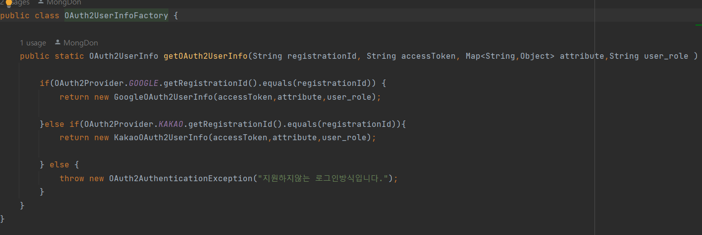
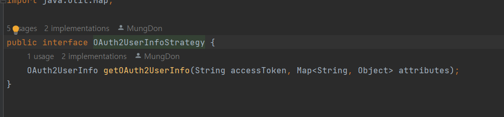
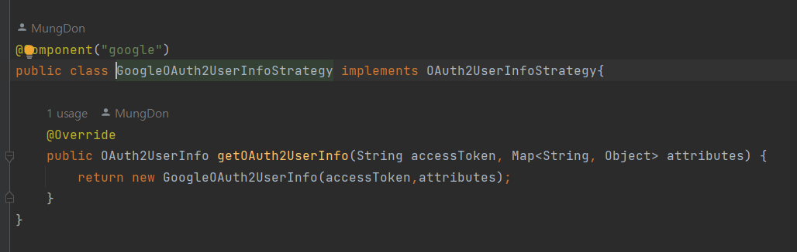
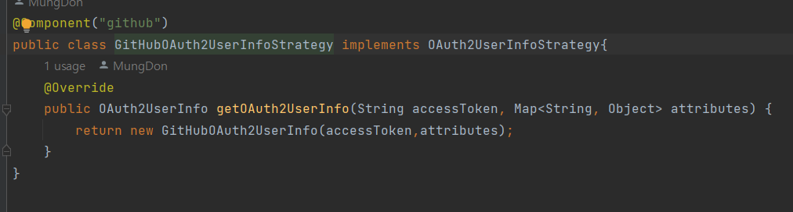

# OCP 적용 예시

&nbsp;    
&nbsp;

## 실제 개발하면서 적용한 부분 

#### 기존 프로젝트에 적용하였던 OAuth2 코드
    
> 기존에 사용했던 소셜로그인 종류에 따라 유저 정보를 만들어주는 클래스입니다.    
> if else 문으로 분기 처리를 하였습니다.   
> 이렇게 되면 확장 할때나 수정할때 계속 기존 코드를 수정해야하고    
> 코드의 가독성과 양이 많아 지는 단점이 생길 수 있습니다.(OCP 위반)

&nbsp;    

#### 현재 진행중인 프로젝트의 적용한 OAuth2 코드

  
    
> 사진과 같이 전략 패턴을 적용해서 구현했습니다.   
> 그렇기 때문에 새로운 소셜로그인을 적용할 때 마다 클래스만 생성해주면  
> 기존 코드를 수정하지 않아도 되며   
> OCP에 위반하지 않게 된다고 생각합니다.