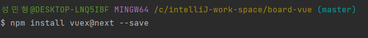
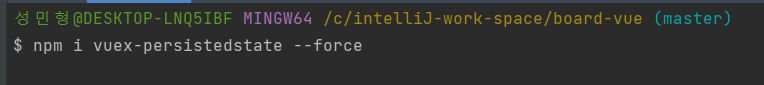
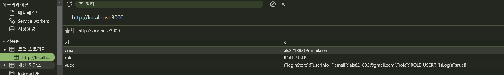

# VueX

## VueX 란?
>Vuex 는 Vue.js 애플리케이션의 중앙 집중식 상태 관리 라이브러리입니다.   
> 
>Vue.js 애플리케이션에서 여러 컴포넌트 간에 상태를 공유하고 관리할 때,  
>각 컴포넌트가 독립적으로 상태를 관리하다 보면 데이터 일관성이 깨지거나,   
>코드가 복잡해질 수 있습니다.
> 
>
>이를 해결하기 위해 Vuex는 단일 저장소(store)를 통해 상태를 중앙에서 관리하며,  
> 모든 컴포넌트가 이 저장소에 접근할 수 있도록 합니다.
 

## Vuex 시작하기


### 1.Install VueX


&nbsp;   
&nbsp;    


### 2.Install Vuex-persistedstate 


> 이 라이브러리를 사용하면 새로고침 시에도 VueX 저장값이 사라지지 않음

&nbsp;     
&nbsp;   
### 3.store instance 생성
```javascript
//./src/store/index.js
import { createStore } from 'vuex';
import loginStore from './modules/loginStore';
import createPersistedState from 'vuex-persistedstate';
export default createStore({
  state: {},
  getters: {},
  mutations: {},
  actions: {},
  modules: {
    loginStore
  },
  plugins: [
    createPersistedState({
      paths: ['loginStore']
    })
  ]
});
```
&nbsp;       
&nbsp;     
   

### 4.VueX 모듈 생성
```javascript
// /src/store/modules/loginStore.js
import axios from 'axios';
import router from '@/router';
const loginStore = {
    state: {
        userInfo: null,
        isLogin: false
    },
    mutations: {
        // 로그인 상태를 변경해주는 코드
        loginSuccess: function (state, info) {
            state.userInfo = info;
            state.isLogin = true;
        },
        logout: function (state) {
            state.userInfo = null;
            state.isLogin = false;
            localStorage.removeItem('email');
            localStorage.removeItem('role');
            localStorage.removeItem('vuex');
        }
    },
    actions: {
        login({ commit }, { loginObj, swalCall }) {
            axios
                .post('http://localhost:8080/login', loginObj, {
                    withCredentials: true
                })
                .then((res) => {
                    const email = res.data.email;
                    const role = res.data.role;
                    const userInfo = {
                        email: email,
                        role: role
                    };
                    localStorage.setItem('email', email);
                    localStorage.setItem('role', role);
                    commit('loginSuccess', userInfo);
                    router.push('/board');
                })
                .catch((error) => {
                    swalCall({
                        title: '실패',
                        text: error.response.data.message,
                        icon: 'error'
                    });
                });
        },
        logout({ commit }, { swalCall }) {
            // 로그아웃 actions
            axios
                .post('/api/member/logout', {
                    withCredentials: true
                })
                .then((response) => {
                    // 성공 시 commit과 함께 메시지 출력
                    commit('logout');
                    const thenFn = () => {
                        router.push('/member/login'); // 로그아웃 후 리다이렉션
                    };
                    swalCall({
                        title: '성공',
                        text: response.data.message, // 서버에서 보낸 메시지
                        icon: 'success',
                        thenFn: thenFn()
                    });
                })
                .catch((error) => {
                    swalCall({
                        title: '실패',
                        text: error.response.data.message,
                        icon: 'error'
                    });
                });
            commit('logout');
        }
    },
    getters: {
        isLogin(state) {
            return state.isLogin;
        },
        userInfo(state) {
            return state.userInfo;
        }
    }
};

export default loginStore;

```
&nbsp;   
&nbsp;   
&nbsp;    


### 5. 사용하기
```javascript
// /src/views/member/LoginView.vue 
import { reactive, inject } from 'vue';
import { useStore } from 'vuex'; // Vuex 스토어 사용을 위한 import

const swalCall = inject('$swalCall');
const store = useStore(); // Vuex 스토어에 접근

const memberLoginObj = reactive({
    email: '',
    password: ''
});

const memberLogin = () => {
    store.dispatch('login', {
        loginObj: memberLoginObj,
        swalCall: swalCall
    });
};
```
>store.dispatch('액션명')  
> vuex 구현한 모듈에 actions 정의된 메서드를 사용하겠다 라는 의미입니다
> 
> 따라서 해당 memberLogin 함수는 서버에 로그인 요청을 보내고    
> 사용자의 데이터와 로그인 여부를 Vuex 상태 값으로 저장하게 됩니다
> 
> ]()